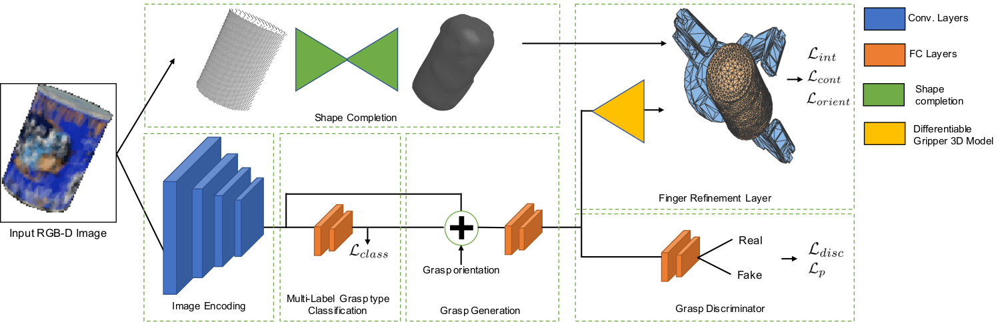

# Multi-FinGAN

This repository includes code used in our work on [Multi-FinGAN:  Generative  Coarse-To-Fine  Samplingof  Multi-Finger  Grasps](https://arxiv.org/pdf/2012.09696.pdf). More specifically, it includes code to train a Multi-FinGAN model and do the simulation experiments.

**Authors**: Jens Lundell\
**Maintainer**: Jens Lundell, jens.lundell@aalto.fi  
**Affiliation**: Intelligent Robotics Lab, Aalto University

## Getting Started

The code was developed for python3.6 and Ubuntu 18.04.

### Dependencies

- Python requirements: Run `pip install -r requirements.txt`.
- [Kaolin](https://github.com/NVIDIAGameWorks/kaolin)
- [Barrett kinematics layer](https://github.com/aalto-intelligent-robotics/pytorch_barrett_hand_forward_kinematics_layer)

Note, for kaolin you need to checkout v0.1

```
git checkout v0.1
python setup.py install --user
```

## Model



Multi-FinGAN takes a single RGB image of one object and predicts a multi-fingered robotic grasp on that objects. Our architecture consists of three stages. First, the object's shape is completed. Next, grasps are generated on the object in the image by feeding it through an image encoder, then predicting grasp types on that object and then generate 6D grasp poses and finger configurations. Finally, the hand is refined to be close to the surface of the target object but not in collision with it by using our parameter-free fully differentiable [barrett kinematics layer](https://github.com/aalto-intelligent-robotics/pytorch_barrett_hand_forward_kinematics_layer).  

## Train

To train a Multi-FinGAN model as in the paper you have to run the following (training data is pulled automatically)

```
python train.py --pregenerate_data
```

We recommend pre-generating training data as this considerably speeds up training. Additional command line flags are found [here](options/base_options.py) and [here](options/train_options.py)

To visualize the training progress do

```
tensorboard --logdir checkpoints/ --samples_per_plugin=images=100
```

## Simulation experiments

Here we detail how to redo the Grasping in Simulation experiments in Section V-B in our [paper](https://arxiv.org/pdf/2012.09696.pdf).

To test the GraspIt! grasps do:

```
python test.py ...
```

To test Multi-FinGAN do:

```
python test.py ...
```

## Headless servers

If you want to run the code on a headless servers but have problems try the following:

```
export QT_API=pyqt
xvfb-run python train.py --pregenerate_data
```

## Citation

If this code is useful in your research, please consider citing:

```
@article{lundell2020multi,
  title={Multi-FinGAN: Generative Coarse-To-Fine Sampling of Multi-Finger Grasps},
  author={Lundell, Jens and Corona, Enric and Le, Tran Nguyen and Verdoja, Francesco and Weinzaepfel, Philippe and Rogez, Gregory and Moreno-Noguer, Francesc and Kyrki, Ville},
  journal={arXiv preprint arXiv:2012.09696},
  year={2020}
}
}
```

## License

This project is licensed under the MIT License - see the [LICENSE](LICENSE) file for details
